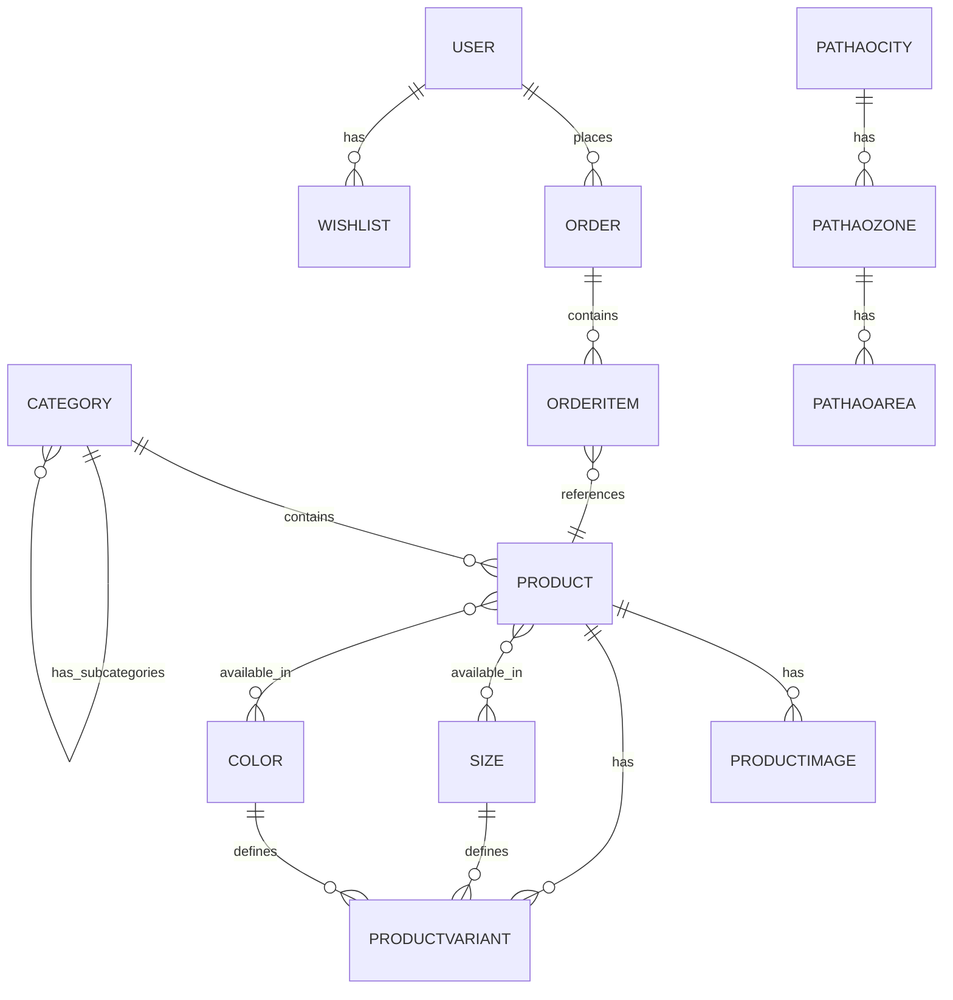

# Data Schemas

> Complete database schema documentation for all Django models in the Foxy Glamour BD project.

## Entity Relationship Diagram



---

## Store App Models

### Category

Hierarchical product categories with self-referential parent relationship.

| Field | Type | Constraints | Description |
|-------|------|-------------|-------------|
| `id` | BigAutoField | PK | Primary key |
| `name` | CharField(200) | indexed | Category name |
| `slug` | SlugField(200) | unique | URL-friendly identifier |
| `parent` | ForeignKey(self) | nullable | Parent category for subcategories |

**Relationships:**
- `children` → Child categories (reverse of parent)
- `products` → Products in this category

**Methods:**
- `get_absolute_url()` → Returns `/category-slug/`

---

### Size

Product size options.

| Field | Type | Constraints | Description |
|-------|------|-------------|-------------|
| `id` | BigAutoField | PK | Primary key |
| `name` | CharField(20) | | Display name (e.g., "US 7", "Small") |
| `code` | SlugField(20) | unique | Code identifier (e.g., "7", "s") |

**Ordering:** By `code`

---

### Color

Product color options.

| Field | Type | Constraints | Description |
|-------|------|-------------|-------------|
| `id` | BigAutoField | PK | Primary key |
| `name` | CharField(20) | | Display name (e.g., "Gold", "Silver") |
| `code` | SlugField(20) | unique | Code identifier (e.g., "gold", "silver") |

**Ordering:** By `name`

---

### Product

Main product model with comprehensive fields for jewelry e-commerce.

| Field | Type | Constraints | Description |
|-------|------|-------------|-------------|
| `id` | BigAutoField | PK | Primary key |
| `category` | ForeignKey(Category) | required | Product category |
| `name` | CharField(200) | | Product name |
| `slug` | SlugField | unique | URL slug |
| `image` | ImageField | | Main product image (uploads to `products/%Y/%m/%d`) |
| `description` | TextField | blank | Product description |
| `price` | DecimalField(10,2) | | Selling price |
| `cost_price` | DecimalField(10,2) | default=0 | Cost to buy/manufacture (for profit calc) |
| `metal` | CharField(100) | choices | Metal type: Gold, Silver, Platinum, Rose Gold, Brass |
| `gemstone` | CharField(100) | blank | Gemstone type |
| `available` | BooleanField | default=True | Is product available for sale |
| `stock` | PositiveIntegerField | default=0 | Global stock quantity |
| `is_adjustable` | BooleanField | default=False | Is adjustable ring (no size needed) |
| `sizes` | ManyToManyField(Size) | blank | Available sizes |
| `colors` | ManyToManyField(Color) | blank | Available colors |
| `discount_percentage` | DecimalField(5,2) | nullable | Percentage discount (0-100) |
| `discount_amount` | DecimalField(10,2) | nullable | Fixed discount in TK |
| `list_image_fit` | CharField(20) | choices | Image fit on list: "cover" or "contain" |
| `list_image_position` | CharField(20) | choices | Image position: center, top, bottom, left, right |
| `meta_title` | CharField(200) | blank | SEO title |
| `meta_description` | TextField | blank | SEO description |
| `meta_keywords` | CharField(255) | blank | SEO keywords |
| `created` | DateTimeField | auto_now_add | Creation timestamp |
| `updated` | DateTimeField | auto_now | Last update timestamp |

**Properties:**
- `has_discount` → Boolean: True if any discount is set
- `discounted_price` → Decimal: Price after discount applied

**Custom Save Logic:**
- Auto-calculates `discount_percentage` when `discount_amount` changes

**Indexes:**
- `(id, slug)` - For URL lookups
- `(name)` - For search
- `(-created)` - For ordering

---

### ProductImage

Multiple images per product (gallery).

| Field | Type | Constraints | Description |
|-------|------|-------------|-------------|
| `id` | BigAutoField | PK | Primary key |
| `product` | ForeignKey(Product) | CASCADE | Parent product |
| `image` | ImageField | | Gallery image (uploads to `products/gallery/%Y/%m/%d`) |
| `created` | DateTimeField | auto_now_add | Upload timestamp |

**Ordering:** By `created` (oldest first)

---

### ProductVariant

Stock management for Size + Color combinations.

| Field | Type | Constraints | Description |
|-------|------|-------------|-------------|
| `id` | BigAutoField | PK | Primary key |
| `product` | ForeignKey(Product) | CASCADE | Parent product |
| `size` | ForeignKey(Size) | nullable, SET_NULL | Size option |
| `color` | ForeignKey(Color) | nullable, SET_NULL | Color option |
| `stock` | PositiveIntegerField | default=0 | Variant stock |

**Constraints:**
- `unique_together`: (product, size, color)

---

### Wishlist

User wishlist items.

| Field | Type | Constraints | Description |
|-------|------|-------------|-------------|
| `id` | BigAutoField | PK | Primary key |
| `user` | ForeignKey(User) | CASCADE | User who added |
| `product` | ForeignKey(Product) | CASCADE | Wishlisted product |
| `added_at` | DateTimeField | auto_now_add | When added |

**Constraints:**
- `unique_together`: (user, product)

---

### Theme

Site-wide theming configuration.

| Field | Type | Constraints | Description |
|-------|------|-------------|-------------|
| `id` | BigAutoField | PK | Primary key |
| `name` | CharField(50) | | Theme name |
| `is_active` | BooleanField | default=False | Only one active at a time |
| `primary_color` | CharField(7) | default='#000000' | Main brand color |
| `text_color` | CharField(7) | default='#171717' | Body text |
| `bg_color` | CharField(7) | default='#ffffff' | Page background |
| `accent_color` | CharField(7) | default='#D4AF37' | Highlights |
| `promo_bg` | CharField(7) | default='#452829' | Promo bar background |
| `button_bg_color` | CharField(7) | default='#000000' | Add to Cart button bg |
| `button_text_color` | CharField(7) | default='#ffffff' | Add to Cart button text |
| `button_hover_bg_color` | CharField(7) | default='#333333' | Add to Cart hover |
| `buy_now_bg_color` | CharField(7) | default='#ffffff' | Buy Now button bg |
| `buy_now_text_color` | CharField(7) | default='#000000' | Buy Now button text |
| `buy_now_hover_bg_color` | CharField(7) | default='#000000' | Buy Now hover bg |
| `buy_now_hover_text_color` | CharField(7) | default='#ffffff' | Buy Now hover text |

**Custom Save Logic:**
- Ensures only one theme is active at a time

---

### HeroSection

Homepage hero section configuration.

| Field | Type | Constraints | Description |
|-------|------|-------------|-------------|
| `id` | BigAutoField | PK | Primary key |
| `name` | CharField(100) | | Internal config name |
| `is_active` | BooleanField | default=False | Only one active (singleton) |
| `background_type` | CharField(10) | choices | "image" or "video" |
| `background_image` | ImageField | nullable | Desktop background image |
| `background_video` | FileField | nullable | Desktop background video (MP4/WEBM) |
| `mobile_background_type` | CharField(10) | choices | Mobile background type |
| `mobile_background_image` | ImageField | nullable | Mobile background image |
| `mobile_background_video` | FileField | nullable | Mobile background video |
| `logo` | FileField | nullable | Hero logo (SVG/image) |
| `headline` | CharField(200) | blank | Main headline text |
| `tagline` | CharField(300) | blank | Subtitle text |
| `show_logo` | BooleanField | default=True | Display logo |
| `show_headline` | BooleanField | default=False | Display headline |
| `show_tagline` | BooleanField | default=True | Display tagline |
| `enable_ken_burns` | BooleanField | default=True | Ken Burns animation |
| `created` | DateTimeField | auto_now_add | Creation time |
| `updated` | DateTimeField | auto_now | Last update |

---

### Visitor

Visitor/analytics tracking.

| Field | Type | Constraints | Description |
|-------|------|-------------|-------------|
| `id` | BigAutoField | PK | Primary key |
| `ip_address` | GenericIPAddressField | nullable | Visitor IP |
| `user_agent` | TextField | nullable | Browser user agent |
| `path` | CharField(255) | | Page visited |
| `referer` | URLField(500) | nullable | Referrer URL |
| `utm_source` | CharField(100) | nullable | UTM source parameter |
| `utm_medium` | CharField(100) | nullable | UTM medium parameter |
| `utm_campaign` | CharField(100) | nullable | UTM campaign parameter |
| `created` | DateTimeField | auto_now_add | Visit timestamp |

**Indexes:**
- `(-created)` - Recent visits
- `(utm_source)` - Traffic analysis

---

## Orders App Models

### Order

Customer order with shipping and payment details.

| Field | Type | Constraints | Description |
|-------|------|-------------|-------------|
| `id` | BigAutoField | PK | Order number |
| `user` | ForeignKey(User) | nullable, SET_NULL | Registered user (optional) |
| `first_name` | CharField(50) | | Customer first name |
| `last_name` | CharField(50) | blank | Customer last name |
| `email` | EmailField | nullable | Customer email |
| `phone` | CharField(11) | | 11-digit phone number |
| `address` | CharField(250) | | Delivery address |
| `postal_code` | CharField(20) | | Postal/ZIP code |
| `city` | CharField(100) | | City name |
| `payment_method` | CharField(10) | choices | cod, bkash, nagad |
| `bkash_number` | CharField(11) | nullable | Sender's mobile money number |
| `transaction_id` | CharField(30) | nullable | Payment transaction ID |
| `shipping_zone` | CharField(20) | choices | inside_dhaka, intercity_dhaka, outside_dhaka |
| `status` | CharField(20) | choices | Pending, Processing, Shipped, Delivered, Cancelled |
| `paid` | BooleanField | default=False | Payment confirmed |
| `pathao_consignment_id` | CharField(50) | nullable | Pathao tracking ID |
| `pathao_order_status` | CharField(50) | nullable | Pathao order status |
| `pathao_city_id` | IntegerField | nullable | Pathao city ID |
| `pathao_zone_id` | IntegerField | nullable | Pathao zone ID |
| `pathao_area_id` | IntegerField | nullable | Pathao area ID |
| `sent_to_pathao` | BooleanField | default=False | Order sent to Pathao |
| `created` | DateTimeField | auto_now_add | Order creation time |
| `updated` | DateTimeField | auto_now | Last update |

**Methods:**
- `get_shipping_cost()` → Returns 80/120/150 based on zone
- `get_total_cost()` → Sum of items + shipping

**Shipping Zone Costs:**
- `inside_dhaka`: ৳80
- `intercity_dhaka`: ৳120
- `outside_dhaka`: ৳150

---

### OrderItem

Individual items within an order.

| Field | Type | Constraints | Description |
|-------|------|-------------|-------------|
| `id` | BigAutoField | PK | Primary key |
| `order` | ForeignKey(Order) | CASCADE | Parent order |
| `product` | ForeignKey(Product) | CASCADE | Product ordered |
| `price` | DecimalField(10,2) | | Price at time of purchase |
| `cost_price` | DecimalField(10,2) | nullable | Cost at time of purchase (for profit) |
| `quantity` | PositiveIntegerField | default=1 | Quantity ordered |

**Methods:**
- `get_cost()` → price × quantity

---

### PathaoCity

Cached Pathao city data.

| Field | Type | Constraints | Description |
|-------|------|-------------|-------------|
| `city_id` | IntegerField | PK, unique | Pathao city ID |
| `city_name` | CharField(100) | | City name |
| `is_active` | BooleanField | default=True | Active status |

---

### PathaoZone

Cached Pathao zone data.

| Field | Type | Constraints | Description |
|-------|------|-------------|-------------|
| `zone_id` | IntegerField | PK, unique | Pathao zone ID |
| `zone_name` | CharField(100) | | Zone name |
| `city` | ForeignKey(PathaoCity) | CASCADE | Parent city |
| `is_active` | BooleanField | default=True | Active status |

---

### PathaoArea

Cached Pathao area data.

| Field | Type | Constraints | Description |
|-------|------|-------------|-------------|
| `area_id` | IntegerField | PK, unique | Pathao area ID |
| `area_name` | CharField(100) | | Area name |
| `zone` | ForeignKey(PathaoZone) | CASCADE | Parent zone |
| `is_active` | BooleanField | default=True | Active status |

---

## Session Data (Non-Database)

### Cart Session Structure

Stored in `request.session['cart']`:

```json
{
  "1_7_gold": {
    "quantity": 2,
    "price": "1500.00",
    "product_id": "1",
    "size": "7",
    "color": "gold"
  },
  "2": {
    "quantity": 1,
    "price": "800.00",
    "product_id": "2",
    "size": null,
    "color": null
  }
}
```

**Key Format:** `{product_id}_{size}_{color}` or just `{product_id}` for items without variants.
