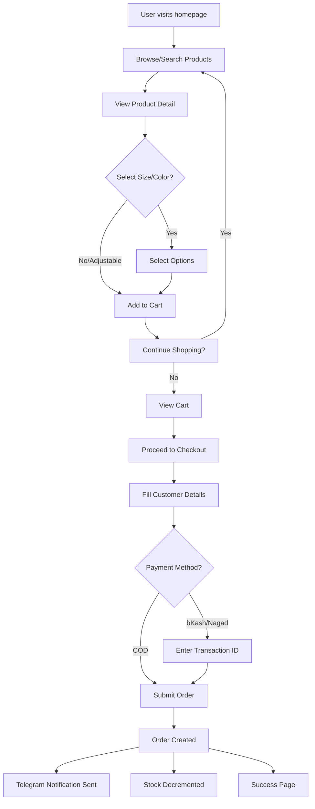
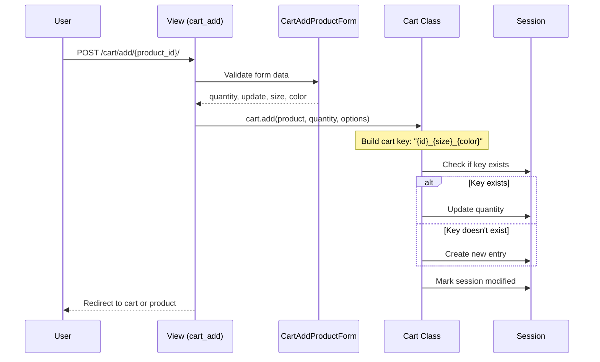
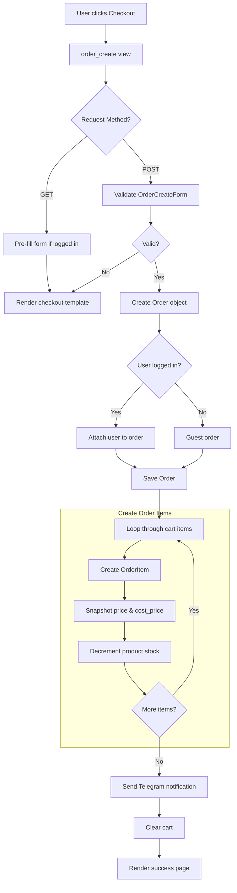
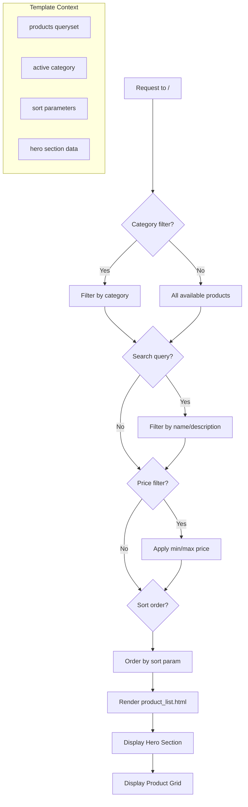
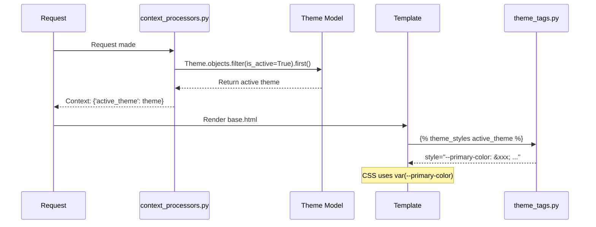
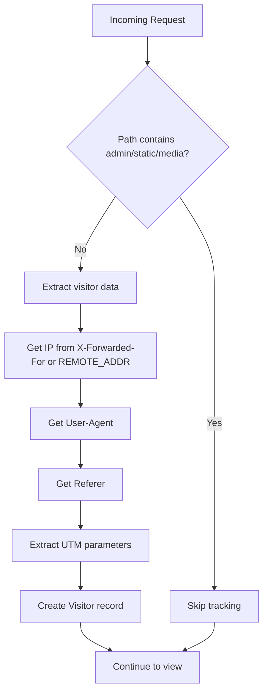
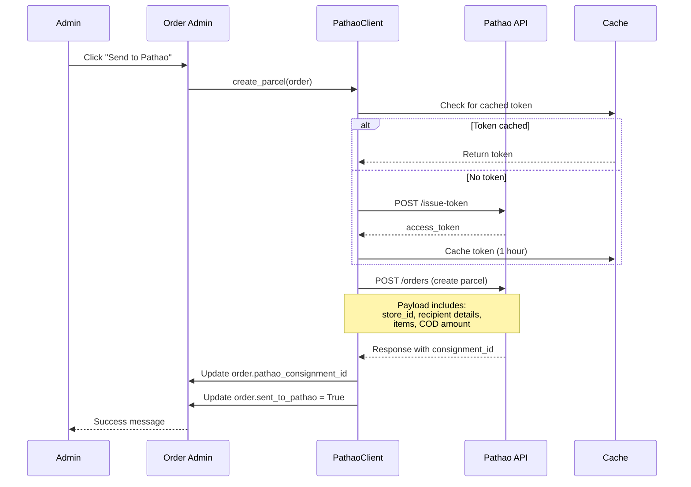
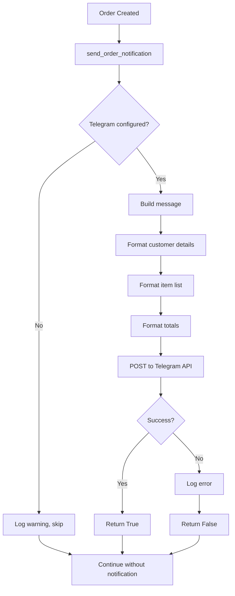
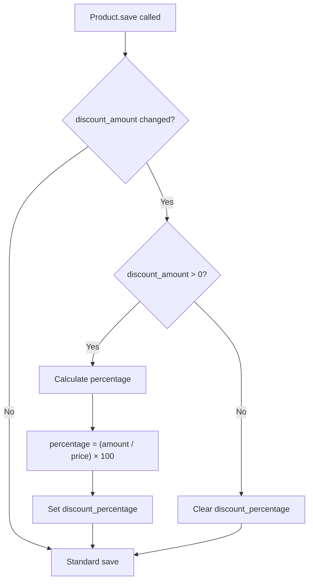

# Logic Flows

> Detailed flowcharts and sequence diagrams for key business processes in Foxy Glamour BD.

## Table of Contents
1. [User Purchase Flow](#1-user-purchase-flow)
2. [Add to Cart Flow](#2-add-to-cart-flow)
3. [Checkout & Order Creation](#3-checkout--order-creation)
4. [Product Display Flow](#4-product-display-flow)
5. [Theme Application Flow](#5-theme-application-flow)
6. [Visitor Tracking Flow](#6-visitor-tracking-flow)
7. [Pathao Integration Flow](#7-pathao-integration-flow)
8. [Telegram Notification Flow](#8-telegram-notification-flow)
9. [Discount Calculation Flow](#9-discount-calculation-flow)

---

## 1. User Purchase Flow

Complete end-to-end purchase journey.



---

## 2. Add to Cart Flow

Session-based cart management.



**Cart Session Structure:**
```python
# Session['cart'] example:
{
    "5_7_gold": {
        "quantity": 2,
        "price": "1500.00",
        "product_id": "5",
        "size": "7",
        "color": "gold"
    }
}
```

---

## 3. Checkout & Order Creation

Order submission and processing.



**Order Creation Code Path:**
1. `orders/views.py:order_create()` - Main view
2. `orders/forms.py:OrderCreateForm` - Form validation
3. `orders/models.py:Order` - Order model
4. `orders/models.py:OrderItem` - Line items
5. `orders/telegram.py:send_order_notification()` - Notification

---

## 4. Product Display Flow

Product listing and detail page rendering.



**Product Detail Flow:**
```mermaid
flowchart TD
    A[Request to /{id}/{slug}/] --> B[get_object_or_404]
    B --> C[Product available?]
    
    C -->|No| D[404 Page]
    C -->|Yes| E[Build context]
    
    E --> F[Get related products]
    F --> G[Serialize variants to JSON]
    G --> H[Initialize CartAddProductForm]
    
    H --> I[Render product_detail.html]
    
    I --> J[Display main image]
    J --> K[Display gallery images]
    K --> L[Display size/color selectors]
    L --> M[Show stock availability]
    M --> N[Display price with discount]
```

---

## 5. Theme Application Flow

Dynamic theming via context processor.



**Theme Variables Injected:**
- `--primary-color`
- `--text-color`
- `--bg-color`
- `--accent-color`
- `--promo-bg`
- `--btn-bg`, `--btn-text`, `--btn-hover`
- `--btn-buy-bg`, `--btn-buy-text`, `--btn-buy-hover-bg`

---

## 6. Visitor Tracking Flow

Analytics middleware tracking.



**Data Captured:**
- IP Address
- User Agent (browser/device)
- Page path
- Referrer URL
- UTM Source
- UTM Medium
- UTM Campaign
- Timestamp

---

## 7. Pathao Integration Flow

Courier API integration for order fulfillment.



---

## 8. Telegram Notification Flow

Order notification to admin.



**Message Format:**
```
🛒 New Order #123

👤 Customer:
John Doe
📞 01712345678
📧 john@example.com

📍 Address:
123 Main Street
Dhaka, 1205
🚚 Inside Dhaka (80 TK)

📦 Items:
  • Gold Ring x2 = ৳3000
  • Silver Bracelet x1 = ৳1500

💰 Subtotal: ৳4500
🚚 Shipping: ৳80
💵 Total: ৳4580

💳 Payment: Cash on Delivery
⏰ 31 Dec 2025, 08:30 PM
```

---

## 9. Discount Calculation Flow

Automatic discount handling.



**Discount Price Calculation:**
```python
@property
def discounted_price(self):
    if self.discount_percentage:
        # Percentage takes priority
        discount = self.price * (self.discount_percentage / 100)
        return round(self.price - discount, 2)
    elif self.discount_amount:
        # Fixed amount discount
        return max(self.price - self.discount_amount, 0)
    return self.price  # No discount
```

---

## Key Decision Points

### Cart Key Generation
```python
# Format: {product_id}_{size}_{color}
parts = [str(product.id)]
if size:
    parts.append(str(size))
if color:
    parts.append(str(color))
cart_item_key = "_".join(parts)
```

### Stock Management
- Stock decremented immediately on order creation
- Prevents negative stock with `max(stock - qty, 0)`
- Variant-level stock if `ProductVariant` exists

### Order Status Flow
```
Pending → Processing → Shipped → Delivered
                   ↘ Cancelled
```
